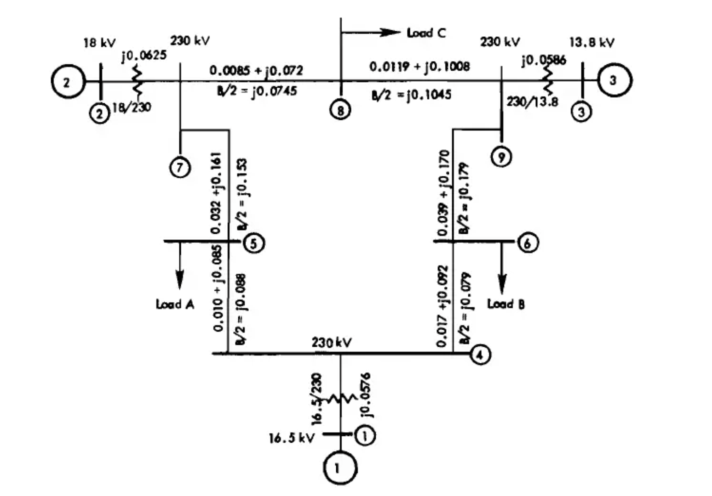
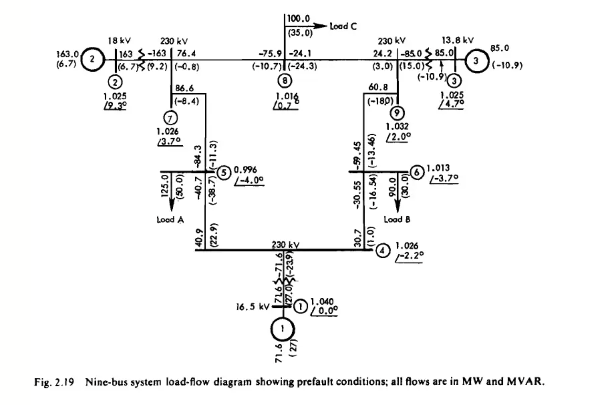

Your draft is already solid, but it reads like raw notes. Below is a cleaned, structured, and “Claude-ready” markdown with proper hierarchy, consistent notation, and clearer phrasing.

I’ve fixed phrasing, removed repetition, and made the flow logical (problem → data → math → steps). No fluff.

---

## Transient Stability Analysis: Nine-Bus System (Example 2.6)

This document presents the complete system data, initial conditions, and preliminary computations required for performing a classical transient stability analysis on a standard nine-bus power system.

---

## 1. Problem Statement

A classical transient stability study is performed on a nine-bus system.

* A **three-phase fault** occurs near **Bus 7**, at the end of **line 5–7**.
* The fault is cleared in **5 cycles (0.083 s)** by opening line **5–7**.

### Assumptions

* Generators are modeled using the **classical model** (constant internal voltage behind transient reactance).
* Loads are represented as **constant impedances**.
* **Damping is neglected**.
* System base: **100 MVA**.

### Objective

Compute all required parameters so that the **swing equations** can be solved for generator rotor angle dynamics.

---

## 2. System Diagrams

### Impedance Diagram (Prefault)

* Shows network topology and line parameters
* Line impedances: ( R + jX )
* Line charging: ( B/2 )
* Transformer reactances are included with generators

---

### Load Flow Diagram (Prefault)

* Bus voltages and angles
* Real and reactive power flows (MW, MVAR)
* Represents steady-state operating condition

---

## 3. System Parameters

### 3.1 Generator Data (Table 2.1)

All reactances are in **per unit (pu)** on a 100 MVA base.

| Parameter            | Gen 1  | Gen 2  | Gen 3  |
| -------------------- | ------ | ------ | ------ |
| Rated MVA            | 247.5  | 192.0  | 128.0  |
| kV                   | 16.5   | 18.0   | 13.8   |
| Power Factor         | 1.0    | 0.85   | 0.85   |
| Type                 | Hydro  | Steam  | Steam  |
| Speed (rpm)          | 180    | 3600   | 3600   |
| ( x_d )              | 0.1460 | 0.8958 | 1.3125 |
| ( x'_d )             | 0.0608 | 0.1198 | 0.1813 |
| ( x_q )              | 0.0969 | 0.8645 | 1.2578 |
| ( x'_q )             | 0.0969 | 0.1969 | 0.25   |
| ( x_l )              | 0.0336 | 0.0521 | 0.0742 |
| ( \tau'_{d0} )       | 8.96   | 6.00   | 5.89   |
| ( \tau'_{q0} )       | 0      | 0.535  | 0.600  |
| Stored Energy (MW·s) | 2364   | 640    | 301    |

---

### 3.2 Prefault Network Data (Table 2.2)

#### Generators (with transformer reactance added)

| Bus | R | X      | G | B       |
| --- | - | ------ | - | ------- |
| 1–4 | 0 | 0.1184 | 0 | -8.4459 |
| 2–7 | 0 | 0.1823 | 0 | -5.4855 |
| 3–9 | 0 | 0.2399 | 0 | -4.1684 |

---

#### Transmission Lines

| Line | R      | X      | G      | B        |
| ---- | ------ | ------ | ------ | -------- |
| 4–5  | 0.0100 | 0.0850 | 1.3652 | -11.6041 |
| 4–6  | 0.0170 | 0.0920 | 1.9422 | -10.5107 |
| 5–7  | 0.0320 | 0.1610 | 1.1876 | -5.9751  |
| 6–9  | 0.0390 | 0.1700 | 1.2820 | -5.5882  |
| 7–8  | 0.0085 | 0.0720 | 1.6171 | -13.6980 |
| 8–9  | 0.0119 | 0.1008 | 1.1551 | -9.7843  |

---

#### Shunt Admittances (Loads)

| Bus        | G      | B       |
| ---------- | ------ | ------- |
| Load A (5) | 1.2610 | -0.2634 |
| Load B (6) | 0.8777 | -0.0346 |
| Load C (8) | 0.9690 | -0.1601 |
| 4          | 0.1670 | —       |
| 7          | 0.2275 | —       |
| 9          | 0.2835 | —       |

---

## 4. Preliminary Calculations

### 4.1 System Base

All quantities are expressed on a **100 MVA base**.

---

### 4.2 Equivalent Load Admittances

Loads are converted into shunt admittances:

[
\bar{y}_{L5} = 1.2610 - j0.5044
]

[
\bar{y}_{L6} = 0.8777 - j0.2926
]

[
\bar{y}_{L8} = 0.9690 - j0.3391
]

---

### 4.3 Initial Generator Conditions

Internal voltages (from load flow):

[
E_1 = 1.0566 \angle 2.2717^\circ
]

[
E_2 = 1.0502 \angle 19.7315^\circ
]

[
E_3 = 1.0170 \angle 13.1752^\circ
]

---

### 4.4 Y-Bus Formation

* Construct the bus admittance matrix ( \mathbf{Y}_{bus} ) using Table 2.2
* Generator buses are converted to **internal buses (1, 2, 3)**
* Transient reactance is included:

Example:
[
X_{2-7} = x'*d + x*{transformer} = 0.1198 + 0.0625 = 0.1823
]

---

### 4.5 Network Reduction

Eliminate all non-generator buses to obtain the reduced admittance matrix:

[
\mathbf{Y}*{red} = \mathbf{Y}*{nn} - \mathbf{Y}*{nr} \mathbf{Y}*{rr}^{-1} \mathbf{Y}_{rn}
]

Compute separately for:

* Prefault network
* Faulted network
* Post-fault (cleared) network

---

## 5. Next Step (What You’ll Actually Solve)

Once ( \mathbf{Y}_{red} ) is obtained:

* Compute electrical power ( P_e ) for each generator
* Solve **swing equations**:

[
M_i \frac{d^2 \delta_i}{dt^2} = P_{m_i} - P_{e_i}
]

* Use numerical integration (RK4 / Euler / etc.)
* Plot:

  * ( \delta_1, \delta_2, \delta_3 ) vs time
  * Relative angles (stability assessment)

---
